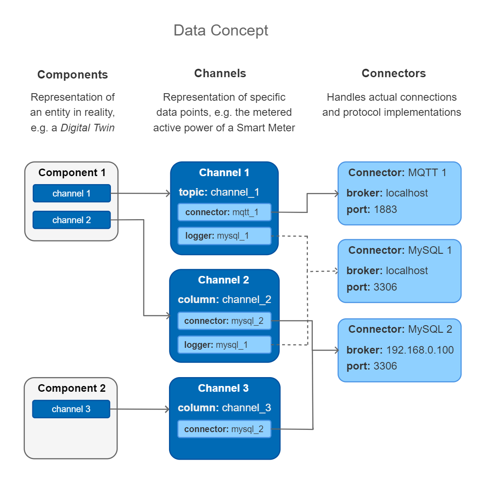
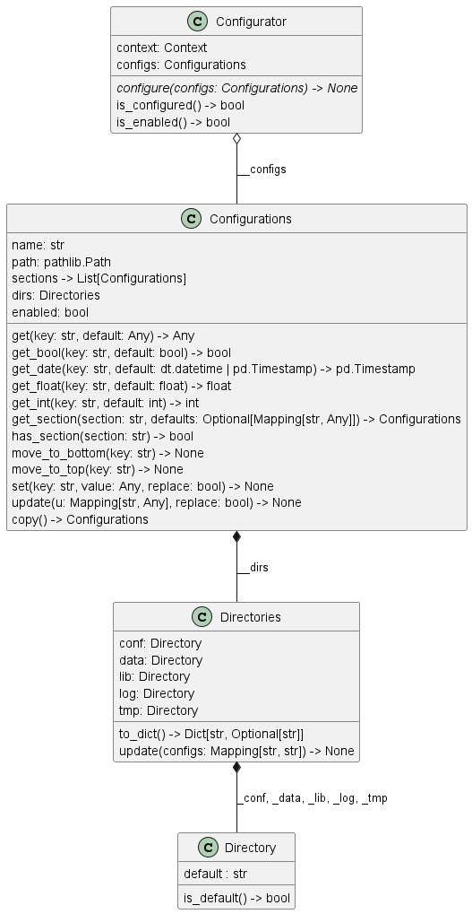
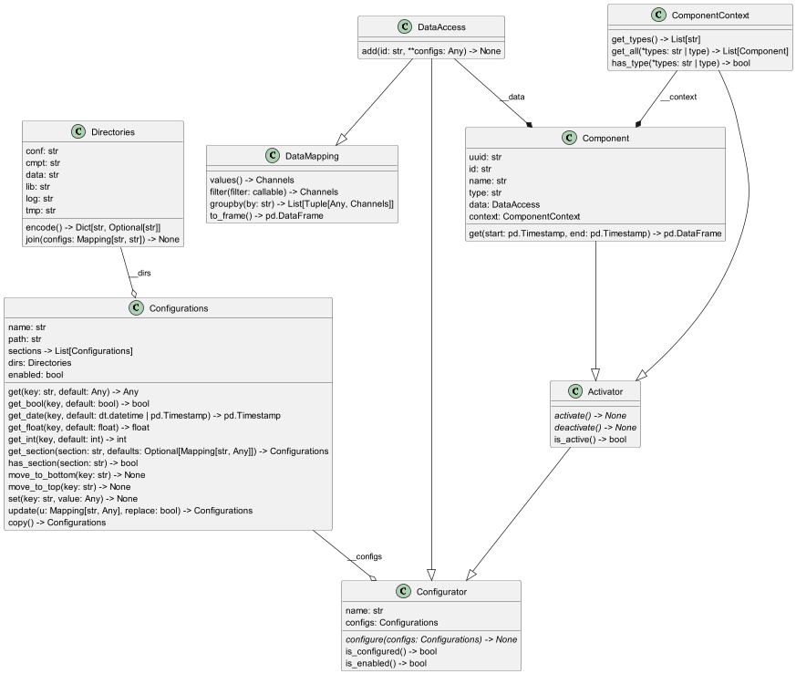
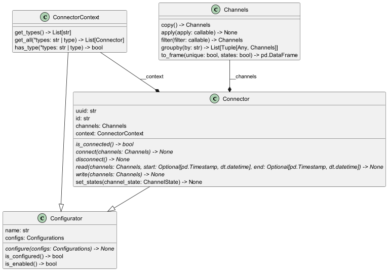
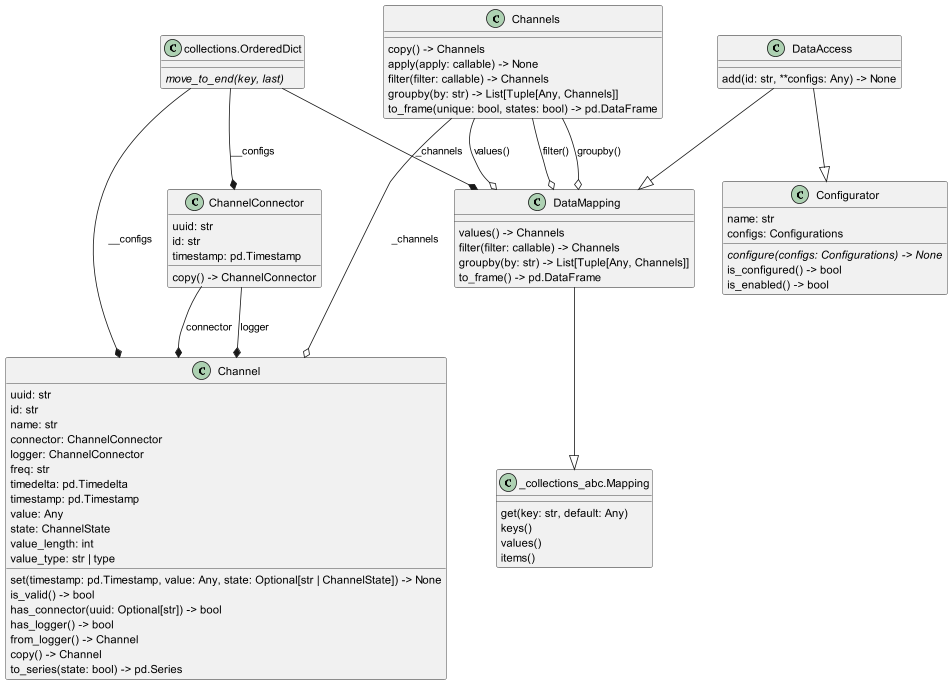

# Architecture

Lories organises data acquisition, processing, and storage through a layered hierarchy of
configurable objects. Each layer adds a specific responsibility, and the overall design keeps
protocol-specific details isolated from the higher-level data model.

## Overview

The high-level data flow is:

```
Application  →  System  →  Components  →  Channels  ↔  Connectors  ↔  External Systems
```

- **Application** is the root container. It loads the configuration, discovers systems, and
  drives the lifecycle (configure → activate → run → deactivate).
- **System** represents a single deployment site or logical grouping. A running application can
  manage multiple systems.
- **Components** are the domain-level building blocks (e.g. a weather station, a PV inverter,
  an energy storage unit). Each component owns a set of channels.
- **Channels** carry individual data points. A channel has a current value, a timestamp, a state,
  and a type. Channels are the unit of data exchange inside lories.
- **Connectors** handle communication with external systems (databases, sensors, APIs, message
  brokers). A connector reads from or writes to one or more channels.



## Core patterns

### Configurator → Registrator → Entity

All managed objects in lories share a triple-inheritance pattern:

- **Entity** provides identity (`id`, `key`, `name`). IDs are hierarchical
  (e.g. `system.component.channel`).
- **Configurator** adds TOML-based configuration loading, validation, and update.
- **Registrator** combines both and adds context-aware registration — each registrator knows its
  parent context and can build hierarchical IDs automatically.



### Contexts as managers

Collections of entities are managed by **Context** classes (e.g. `ComponentContext`,
`ConnectorContext`, `DataContext`). A context is a `MutableMapping` that provides:

- Dict-like access by key
- Filtering by type or predicate
- Grouping (`groupby`) for batch operations
- Natural-language-aware sorting

### Components

A component aggregates sub-components, connectors, converters, and a data context (channels).
Components are registered via the `@register_component_type(...)` decorator and instantiated
from configuration sections.



### Connectors

Connectors are registered via `@register_connector_type(...)` and implement the `Connector`
interface: `connect()`, `disconnect()`, `read()`, `write()`. Each connector type handles a
specific protocol or data source — see the [Connectors](../connectors/index.md) section for
the full list.

Connectors operate on **Resources** — a filtered view of the channels they are responsible for.
This allows multiple connectors to coexist within a single component, each handling different
channels.



### Channels

A channel wraps a single data value with metadata: timestamp, type, unit, state, and frequency.
Channels can have:

- A **connector** for reading from / writing to an external system
- A **logger** for persistent storage
- A **converter** for type transformation
- **Listeners** that react to value changes
- **Processors** that transform data in the pipeline (e.g. integration, differentiation)

Channels are grouped into a `DataContext`, which supports batch reads, writes, and
DataFrame export.


