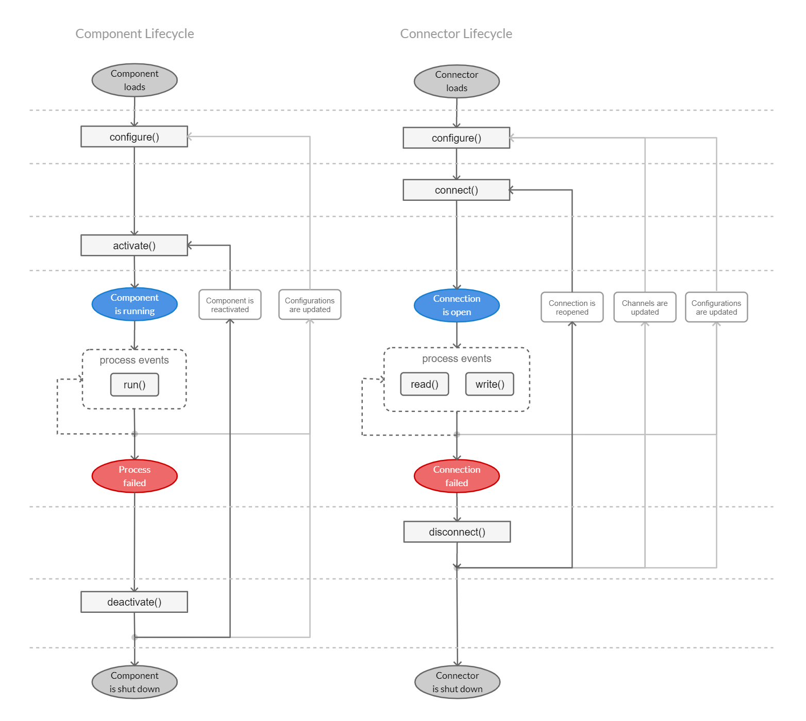
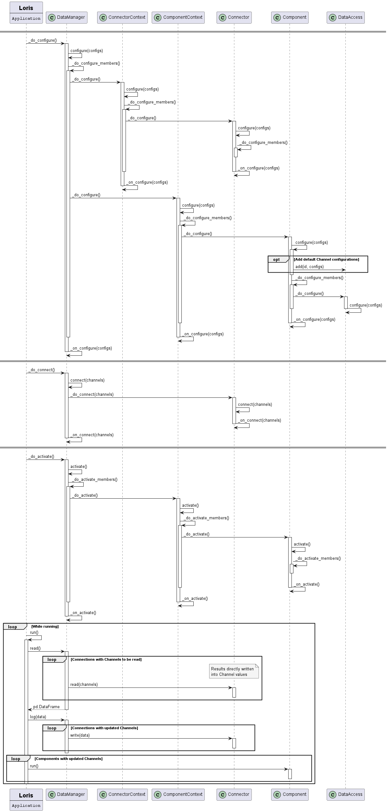
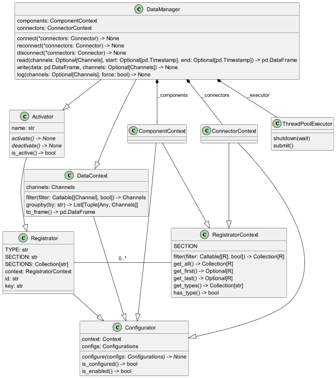

# Lifecycle

Every lories application follows a four-phase lifecycle: **configure**, **activate**, **run**,
and **deactivate**. Understanding these phases helps when writing components, connectors, or
debugging startup issues.

## 1. Configuration

The configuration phase is triggered when the `Application` is loaded (e.g. via `lories.load()`
or the CLI). During this phase:

1. **TOML files are parsed** — the application scans the configured directory for `system.conf`
   files and component configuration files.
2. **Objects are instantiated** — for each configuration section, the framework resolves the
   registered type (via `@register_component_type` / `@register_connector_type`) and creates
   an instance.
3. **`configure()` is called** on each object, allowing it to validate parameters, build
   internal state, and register itself in its parent context.
4. **Hierarchical IDs are built** — each object computes its full ID from the parent chain
   (e.g. `system.weather.temperature`).

At the end of this phase, all components, connectors, and channels exist as configured objects,
but no external connections are open.

## 2. Activation

The activation phase connects the system to the outside world:

1. **Connectors connect** — each connector's `connect(resources)` is called with the channels
   it is responsible for. The connector opens sockets, serial ports, database connections, etc.
2. **Listeners are registered** — channels with asynchronous data sources (MQTT, LoRa, RevPi
   events) register callbacks.
3. **Components activate** — components perform any post-connection setup.

If a connector fails to connect, the error is logged and the channel's state is set to
`DISCONNECTED`.

## 3. Runtime

During the runtime phase, a **DataManager** coordinates periodic read/write cycles using a
`ThreadPoolExecutor`:

1. **Read cycle** — for each connector, `read(resources)` is called. The returned DataFrame
   is dispatched to the corresponding channels via `channel.set(timestamp, value)`.
2. **Processing** — registered processors (integrators, differentiators) and listeners are
   triggered by value updates.
3. **Write cycle** — channels marked for logging or replication push their data to the
   configured logger/replication connectors.
4. **Repeat** — the cycle runs at the configured frequency (`freq`) for each channel group.

## 4. Deactivation

When the application shuts down (signal, exception, or explicit stop):

1. **Components deactivate** — cleanup hooks run.
2. **Connectors disconnect** — `disconnect()` is called, closing connections and releasing
   resources.
3. **Threads are shut down** — the thread pool executor is terminated.

## Data Manager

The DataManager orchestrates the runtime loop. It manages the thread pool, schedules read/write
tasks, and handles timeouts and errors per connector.

## Channel states

During the lifecycle, a channel's state reflects its health:

| State | Meaning |
|---|---|
| `DISABLED` | Channel is not active |
| `DISCONNECTED` | Connector is not connected |
| `CONNECTED` | Connected but no valid data yet |
| `VALID` | Current value is valid |
| `NOT_AVAILABLE` | Source reports no data available |
| `TIMEOUT` | Read timed out |
| `READ_ERROR` | Error during read |
| `WRITE_ERROR` | Error during write |
| `UNKNOWN_ERROR` | Unclassified error |
| `ARGUMENT_SYNTAX_ERROR` | Configuration/parameter error |
